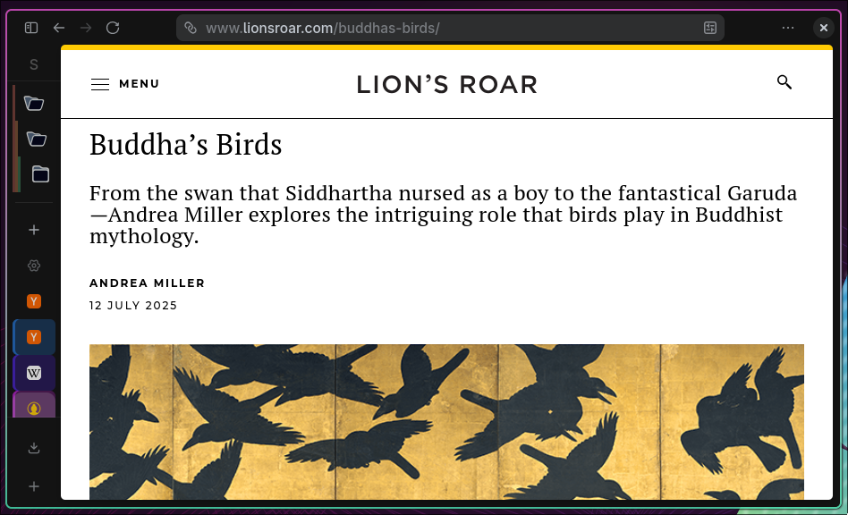

# zen-crowd

Internet browsing requires [great peace of mind](https://zenceomaintenance.wordpress.com/2018/03/13/assembly-of-japanese-bicycle-take-great-peace-of-mind/).

A mod for [Zen Browser](https://zen-browser.app/) that improves the visual hierarchy and interaction of nested folders and tabs in the tab sidebar.


<sub>Detail after Kishi Chikudo (Japanese, 1826-1897), <em>Crows in Early Winter</em>, ca. 1895. Ink and color on gold-leaf ground; pair of six-panel folding screens. Santa Barbara Museum of Art, museum purchase with funds provided by Lord and Lady Ridley-Tree, Priscilla Giesen, and special funds, 2002.7.1-2. Source identification: Santa Barbara Museum of Art, <a href="https://www.sbma.net/exhibitions/pathsofgold"><em>Paths of Gold: Japanese Landscape and Narrative Paintings from the Collection.</em></a> The image was enhanced using Gemini. The original image can be found <a href="https://i.pinimg.com/736x/43/44/f9/4344f9321754eca845b19470682ffd58.jpg">here</a>.</sub>


## About the logo

These are crows. Crows are [zen birds](https://www.lionsroar.com/buddhas-birds/). This project also deals with *crow*ded folders, with many nested folders and items. I think the reference is nice :)

## What it does

A screenshot sometimes is worth a thousand feature descriptions:



### Nested Folder Colorization
Applies color to `zen-folder` elements based on their nesting depth, making it easy to visually trace the folder hierarchy at a glance.

- **Depth-aware** — background colors cycle through a six-step palette; left-side lines stop after depth 7
- **Theme-aware** — colors adapt to both light and dark themes via `light-dark()`
- **Configurable treatment** — use a translucent background fill or a left-side line
- **Optional root styling** — leave top-level folders uncolored and start colors at subfolders
- **Two color sources**:
  - **Theme accent** (default) — derives the palette from Zen's current accent color (`--zen-primary-color`) with hue rotation
  - **Fixed palette** — warm, distinct hues per depth level

### Hover-Expand
Hovering a collapsed folder automatically expands it; moving the mouse away collapses it after a short delay.

- Folders containing the active tab stay open
- Folders manually expanded by the user before hovering stay open
- Moving the cursor from a parent into a child folder does not flicker the parent shut

### Subtab Grouping
Tints each tab by its depth in the opener tree, so the parent/child relationship is visible at a glance.

- A tab opened from a parent (middle-click, `target=_blank`, "Open Link in New Tab", `window.open`) gets `parent.depth + 1`
- Survives session restore via per-tab UUIDs, with a tab-order snapshot fallback
- Dragging a tab makes it inherit the hierarchy level of the tab immediately below it
- Closing a parent promotes its children to roots; their subtree retags at the new shallower depths
- Tab right-click actions can copy a tab tree to a native Zen folder, copy only its subtabs to a native Zen folder, or close a tab with all subtabs
- Folder right-click actions can copy native Zen folder contents back out as regular tabs
- Visual prefs default to inheriting from the folder colorization mod's settings, so the two mods look consistent out of the box

Native Zen folder actions use URL copies so the original colorized tabs and native folders stay in place. New root folders are created through Zen's normal folder area placement, and subtab hierarchy is represented as nested native folders under each copied parent tab. Copied tabs reload from their URLs; live page state, form state, and back-forward history are not cloned.

## Installation

### Sine

Use [Sine](https://github.com/CosmoCreeper/Sine) if you already manage Zen Browser mods through it.

When `zen-crowd` is available in the official Sine marketplace, install it from **Settings → Sine Mods → Marketplace**. Official store installs are trusted by Sine and do not require enabling unsafe JavaScript.

Until the marketplace listing is accepted, use Sine's unpublished repository flow:

1. Install Sine v2.3.1 or newer.
2. Enable unpublished mod installs in Sine.
3. Install this repository URL:
   ```
   https://github.com/gchamon/zen-crowd
   ```
4. For unpublished JavaScript mods, enable Sine's unsafe JS setting if Sine prompts for it or if the scripts do not load.
5. Restart Zen, or rebuild mods from Sine if available.

The Sine package appears as one `zen-crowd` mod and enables both Nested Folder Colorization and Subtab Grouping.

Maintainer publishing notes for the official Sine store live in [`docs/sine-store-publication.md`](docs/sine-store-publication.md).

### Manual Profile Deployment

Use the manual path for local development, direct profile installation, or profiles that do not use Sine. It preserves the existing fx-autoconfig deployment model and installs the two Zen mod entries separately.

#### Prerequisites

1. **fx-autoconfig** — required for the mod JS to execute. `deploy.sh` installs both the application-level files (with `sudo`) and the profile-side boot files automatically on first run.

2. [**yq**](https://github.com/mikefarah/yq) and **jq** — required by `deploy.sh`:
   ```bash
   sudo pacman -S go-yq jq  # Arch
   brew install yq jq       # macOS
   ```

#### Install

```bash
bash deploy.sh
```

The script will:
1. Check for and optionally install fx-autoconfig application-level files (requires `sudo`)
2. List profiles from `~/.zen/profiles.ini` (Linux) or `~/Library/Application Support/zen/profiles.ini` (macOS)
3. Verify the selected profile has fx-autoconfig profile-side files
4. Copy shared libraries → `chrome/utils/zen-crowd-shared.sys.mjs` and `chrome/utils/zen-crowd-subtab-policy.sys.mjs`
5. Copy mod metadata for both mods → `chrome/zen-themes/zen-crowd-folder-colorization/` and `chrome/zen-themes/zen-crowd-subtab-grouping/`
6. Copy both scripts → `chrome/JS/nested-folder-colorization.uc.js` and `chrome/JS/subtab-grouping.uc.js`
7. Register both mods in `zen-themes.json`

**First install only:** clear the startup cache before restarting — open `about:support` → **Clear startup cache**, then restart Zen.

#### Verify

Open the Browser Console (Ctrl+Shift+J) and look for:
```
[zen-crowd-folder-colorization] loaded — colorSource: palette, hoverExpand: true
[zen-crowd-subtab-grouping] loaded
```

#### Update

Re-run `bash deploy.sh` and restart Zen.

#### Uninstall

```bash
bash remove.sh
```

The script removes both zen-crowd mods from the selected profile, deletes their copied scripts and shared libraries, and removes their entries from `zen-themes.json`. It leaves fx-autoconfig in place because other userChrome scripts may use it.

**Profile paths:**
- Linux: `~/.zen/<profile-dir>/`
- macOS: `~/Library/Application Support/zen/<profile-dir>/`


## Project structure

```
├── src/
│   ├── lib/
│   │   ├── zen-crowd-shared.sys.mjs    # Shared helpers (palette, prefs, windows)
│   │   └── zen-crowd-subtab-policy.sys.mjs # Pure subtab hierarchy policy
│   ├── nested-folder-colorization.js   # Folder colorization mod source
│   └── subtab-grouping.js              # Subtab grouping mod source
├── dist/
│   ├── nested-folder-colorization/     # Zen mod package
│   │   ├── zen-mod.json                # Mod metadata
│   │   ├── preferences.json            # Settings UI manifest
│   │   └── chrome.css                  # Placeholder (all styling is JS-injected)
│   └── subtab-grouping/                # Zen mod package (same shape)
├── sine/                               # Single Sine package wrapper
├── spikes/                             # Feasibility proof-of-concepts from early exploration
├── docs/
│   ├── work-items/                     # Executable planning units
│   ├── epics/                          # Larger feature streams
│   └── architecture/                   # Decisions and methodology
├── tests/                              # Node tests for pure mod policy
├── zen-browser-desktop/                # Reference checkout (excluded from distribution)
├── zen-sidebery-mod/                   # Reference checkout (excluded from distribution)
├── theme.json                          # Sine package metadata
└── deploy.sh                           # Install/deploy helper
```

## Configuration

When installed through Sine, settings are surfaced in Sine's mod settings panel under the single `zen-crowd` entry. When installed manually as Zen mods, settings are surfaced in **Settings → Zen Mods → Configure**.

### Nested Folder Colorization

| Setting | Type | Default |
|---|---|---|
| Color source | dropdown | Theme accent |
| Color top-level folders | checkbox | true |
| Color treatment | dropdown | Background fill |
| Hover-expand folders | checkbox | true |
| Hover collapse delay | string (ms) | 500 |
| Tint opacity — light theme | string (0–100) | 18 |
| Tint opacity — dark theme | string (0–100) | 22 |
| Folder border radius | string (px) | 6 |

### Subtab Grouping

All visual prefs default to **blank**, meaning "inherit from the folder colorization mod's setting." Override any of them to break the link.

| Setting | Type | Default |
|---|---|---|
| Enable subtab grouping | checkbox | true |
| Color source | dropdown | (inherit) |
| Custom base color | string | (inherit) |
| Custom colors | string | (inherit) |
| Color treatment | dropdown | (inherit) |
| Tint opacity — light theme | string (0–100) | (inherit) |
| Tint opacity — dark theme | string (0–100) | (inherit) |
| Border radius | string (px) | (inherit) |

Changes to either mod apply immediately across all open windows without restart.

## Development

### Prerequisites for Browser Console paste
- `devtools.chrome.enabled` → `true`
- `devtools.debugger.remote-enabled` → `true`

### Ephemeral loading

Paste `src/nested-folder-colorization.js` or `src/subtab-grouping.js` into the Browser Console (Ctrl+Shift+J) and press Enter. Re-pasting replaces the previous injection cleanly — no restart needed.

Note: paste-loading uses the default `chrome://userchromejs/content/` module path, so it requires the shared modules to already be installed in `chrome/utils/` (i.e. you've already run `deploy.sh` once on the profile).

### Tests

Automated tests cover the pure subtab hierarchy policy and manifest shape. Browser-facing integration with Zen APIs still needs manual smoke testing in Zen.

```bash
npm test      # unit tests
npm run ci    # syntax checks, shell checks, and unit tests
```

## Roadmap

- [x] Nested folder colorization by depth
- [x] Hover-expand / hover-collapse behavior
- [x] Zen native mod settings UI integration
- [x] Subtab grouping by opener depth

## License

See individual subdirectories. The mod source (`src/` and `dist/`) is released under the same license as the project root. The README artwork is included for attribution and presentation only; no artwork license is granted by this repository.
